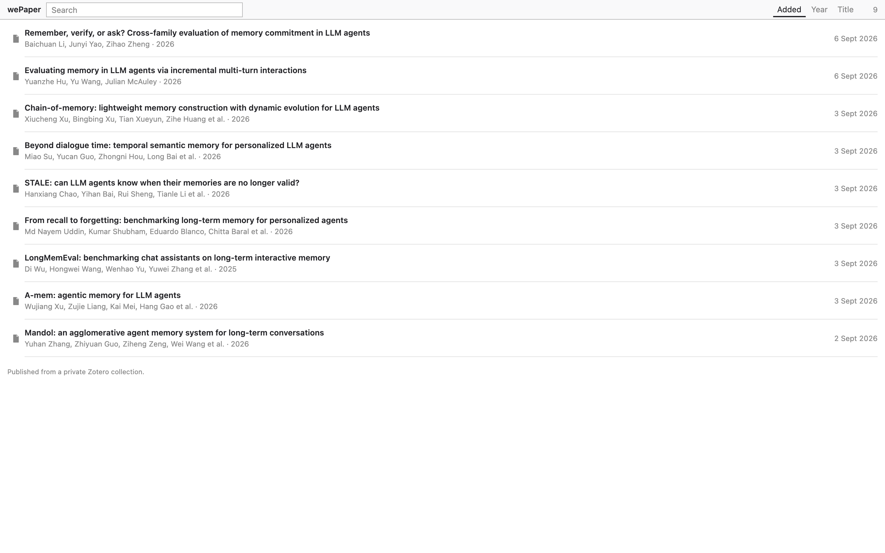

# wePaper

A personal Zotero paper library on the web.

**Public library:** https://wepaper.plainlist.space

**Source:** https://github.com/rainhuang0220/wePaper

Put papers in a Zotero collection. A local agent copies metadata and PDFs to a small server. Anyone with the URL can browse the list and read the PDF. There is no visitor login. Uploads require a secret.

```
Zotero on your Mac
      │  Local API (read-only)
      ▼
wepaper sync / daemon
      │  HTTPS + bearer token
      ▼
wePaper server  →  public list  →  browser-native PDF
```

## Features

- Sync a chosen Zotero collection without writing `zotero.sqlite`
- Public catalog as a dense list (title, authors, year)
- Click a title to open the real PDF in the browser’s native viewer
- `/paper/:id` redirects to `/paper/:id/pdf`
- Byte-range PDF transport (`application/pdf`, Range / 206)

## Screenshots



## Requirements

- Zotero 7+ (built against Zotero 10)
- Python 3.12 and [uv](https://astral.sh/uv)
- Node 20+ to build the web UI

## Local development

```bash
uv sync --extra dev
cd web && npm install && npm run build && cd ..
export WEPAPER_DATA_DIR=./data
export WEPAPER_SYNC_TOKEN=dev-token
export WEPAPER_COLLECTION="wePaper,Agent Memory"
export WEPAPER_SERVER_URL=http://127.0.0.1:8788
uv run wepaper serve --host 127.0.0.1 --port 8788
```

```bash
uv run wepaper doctor
uv run wepaper sync --once
```

Open http://127.0.0.1:8788/

## Sync setup

1. Settings → Advanced → **Allow other applications on this computer to communicate with Zotero**
2. Create a collection named `wePaper` (or set `WEPAPER_COLLECTION`)
3. Keep Zotero running while the agent syncs

The agent never writes `zotero.sqlite` and never changes your library.

| Command | Purpose |
| --- | --- |
| `wepaper doctor` | Check Zotero, Local API, collections, token |
| `wepaper sync --once` | One reconcile |
| `wepaper daemon` | Background poll |
| `wepaper install-agent` | macOS launchd (token in `~/.config/wepaper/agent.env`, not the plist) |
| `wepaper serve` | API + UI |

## Server deployment

See [docs/deployment.md](docs/deployment.md). Production origin is `https://wepaper.plainlist.space`.

## Security model

- Public read, bearer-authenticated write
- `WEPAPER_SYNC_TOKEN` must not appear in the frontend, git, or `VITE_*` variables
- `/openapi.json` is disabled; CSP + `X-Frame-Options: DENY`
- Blob keys are `{sha256}.pdf`; traversal is rejected; upload size is capped
- Visibility: `#wepaper:private` hides list + PDF; collection removal hides

## Testing

```bash
uv run pytest
cd web && npm run e2e
```

## Reader architecture

The server stores real PDF blobs and serves them as `application/pdf` with byte ranges. Clicking a paper title navigates to `/paper/:id/pdf`. The browser’s native PDF viewer is the default reading experience. Bookmarked `/paper/:id` URLs redirect there. There is no in-app PDF.js viewer.

## License

MIT. Third-party notices are in [THIRD_PARTY_NOTICES.md](THIRD_PARTY_NOTICES.md).
