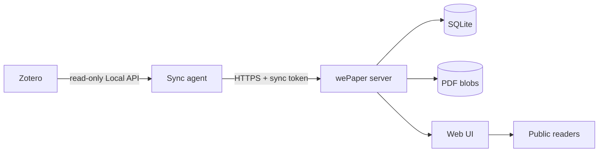
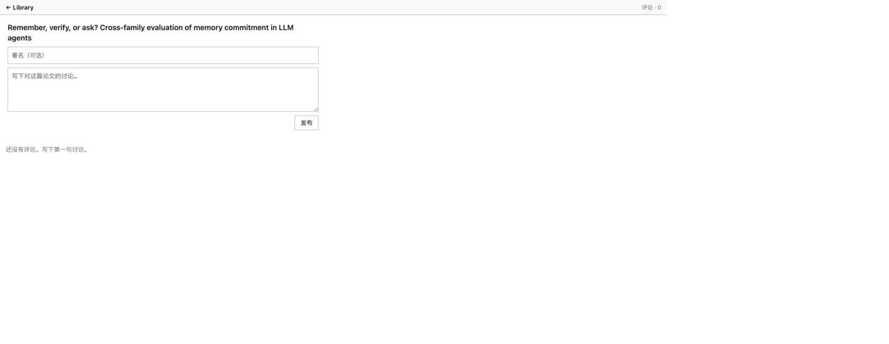
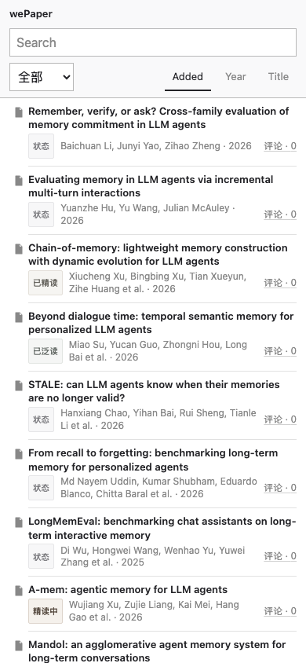

# wePaper

Publish selected Zotero collections as a public paper library.

If you already keep papers in Zotero and want a public reading list with the actual PDFs, this is that list.

[Live demo](https://wepaper.plainlist.space) · [Release notes](https://github.com/rainhuang0220/wePaper/releases/latest)

[](https://github.com/rainhuang0220/wePaper/releases/latest)
[](LICENSE)

[简体中文](README.zh-CN.md)


## Features

- Sync chosen Zotero collections without writing `zotero.sqlite`
- Automatic near-real-time sync from a login LaunchAgent; open tabs refresh in place
- Store the real PDFs and serve them with HTTP Range
- Desktop: click a title to open the browser-native PDF
- Mobile: tap a title for the same raw PDF (the browser may display it or ask to download)
- Six reading-status labels, editable by any visitor
- Per-paper discussion: comments, one-level replies, likes
- Desktop and mobile: `评论 · N` opens the discussion
- Mobile: long-press a title to open the same discussion
- No visitor accounts

## How it works



The background agent copies metadata and PDFs from a running Zotero library. After `wepaper daemon install`, adding a paper to the configured collection is enough: the daemon notices the change in a few seconds, updates the server, and an already-open catalog tab refreshes without F5. Sync writes require `WEPAPER_SYNC_TOKEN`. Public visitors can browse, set reading status, and discuss papers without signing in. That is an intentional small-audience choice for v1.7.

## Quick start

**Look.** Open the [live demo](https://wepaper.plainlist.space).

**Run locally.**

```bash
uv sync --extra dev
cd web && npm install && npm run build && cd ..
export WEPAPER_DATA_DIR=./data
export WEPAPER_SYNC_TOKEN=dev-token
uv run wepaper serve --host 127.0.0.1 --port 8788
```

Open http://127.0.0.1:8788/ — an empty catalog until you sync.

**Publish a collection.**

```bash
export WEPAPER_COLLECTION="wePaper"
export WEPAPER_SERVER_URL=http://127.0.0.1:8788
export WEPAPER_SYNC_TOKEN=dev-token
uv run wepaper doctor
uv run wepaper daemon install
```

After that, keep Zotero running. New or changed items in the configured collection sync automatically. `wepaper sync --once` is only for diagnostics or a one-shot repair.

`WEPAPER_COLLECTION` is a comma-separated list. Every listed collection, including its subcollections, is published.

## Zotero setup

1. Use Zotero 7+ (developed against Zotero 10).
2. Settings → Advanced → **Allow other applications on this computer to communicate with Zotero**.
3. Put the papers you want public in one or more collections (default name `wePaper`), or set `WEPAPER_COLLECTION`.
4. Keep Zotero running. The LaunchAgent daemon follows the collection while you work.

The agent never writes `zotero.sqlite` and never changes the Zotero library.

| Command | Purpose |
| --- | --- |
| `wepaper doctor` | Check Zotero, Local API, collections, daemon, and the server |
| `wepaper status` | Daemon, Zotero, server, last change / last sync / last error |
| `wepaper daemon` | Foreground hybrid loop (version poll + reconcile) |
| `wepaper daemon install` | macOS LaunchAgent (token stays in `~/.config/wepaper/agent.env`) |
| `wepaper daemon uninstall` | Remove the LaunchAgent |
| `wepaper sync --once` | One-shot reconcile (diagnostics / repair) |
| `wepaper serve` | API + built UI |

Details: [docs/sync.md](docs/sync.md).

## Reading status and discussions

Any visitor can set or clear a paper’s status from the catalog. Unset papers show `状态`. The six labels are:

- 待泛读
- 待精读
- 泛读中
- 精读中
- 已泛读
- 已精读

Clicking the status chip does not open the PDF. Filters (`全部`, each status, and 待读 / 阅读中 / 已读) combine with search.

Each paper has one discussion at `/paper/:id/discussion`.



Visitors may comment, reply once under a comment, and like. An optional 署名 is a display name, not an account. Comments and status survive Zotero metadata updates, PDF replacement, and hide/reappear of the same item.

Details: [docs/discussions.md](docs/discussions.md).

## Reading PDFs

Desktop browsers use the native PDF viewer: Library → `/paper/:id` → 302 → `/paper/:id/pdf`.

Mobile uses the same raw-PDF path. That is the shipped fallback. Some phones show the PDF; others offer a download. Both are acceptable. wePaper does not claim a reliable inline Android viewer.



On a phone, long-press a title to open the discussion. A normal tap still starts reading. `评论 · N` is the visible discussion entry on every device.

Details: [docs/mobile.md](docs/mobile.md).

## Deployment

See [docs/deployment.md](docs/deployment.md). The public demo is `https://wepaper.plainlist.space`. A [changelog](CHANGELOG.md) lists tagged releases.

The operator builds `web/dist`, rsyncs the tree, and runs systemd + nginx in front of uvicorn on loopback. SQLite and PDF blobs live under `WEPAPER_DATA_DIR`.

## Security and trust model

- Listing, PDFs, status, and comments are public. There is no visitor login.
- Zotero ingest (`/api/v1/sync/*`) requires `Authorization: Bearer`. Keep `WEPAPER_SYNC_TOKEN` off the frontend, out of git, and out of `VITE_*` variables.
- Comment and status writes are validated (length, enums, parameterized SQL). Bodies render as text, not HTML.
- PDFs are stored as `{sha256}.pdf`. Path traversal is rejected. Upload size is capped.
- `#wepaper:private` hides the paper from the list and 404s the PDF. Removing an item from the collection hides it.
- `/openapi.json` is disabled. Responses send CSP and `X-Frame-Options: DENY`.

Open writes are easy to abuse. v1.6 accepts that for a small audience. See [SECURITY.md](SECURITY.md).

## Development and tests

```bash
uv run pytest
cd web && npm run e2e
```

Python 3.12, [uv](https://astral.sh/uv), and Node 20+ are required. Status and comment E2E tests use an isolated fixture database, not the production papers.

Architecture notes: [docs/architecture.md](docs/architecture.md).

## Known limitations

- Mobile reading is a raw PDF / download, not an inline wePaper viewer.
- Anyone with the URL can change labels and post comments. Visitors cannot edit or delete comments.
- Likes are not strongly unique across browsers.
- Every public PDF in the synced collection is world-readable, including publisher copies.
- The library is selected collections, not a full Zotero replacement.
- `wepaper daemon install` is macOS launchd only. Linux and Windows can run `wepaper daemon` themselves.
- There is no account system, moderation queue, or notification mail.

## License

MIT. Third-party notices are in [THIRD_PARTY_NOTICES.md](THIRD_PARTY_NOTICES.md).
