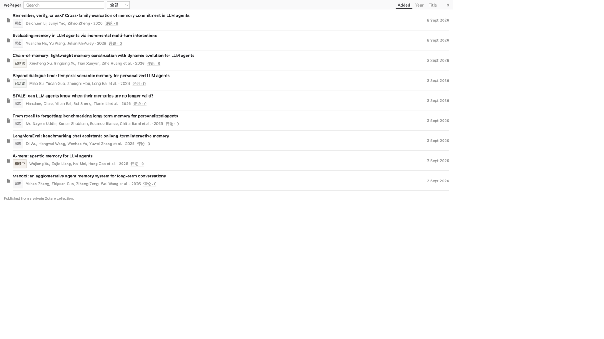

# wePaper

把选定的 Zotero 文献集合发布成公开的论文网页库。

如果你已经在用 Zotero，只想把若干集合连同 PDF 公开到网上，可以用它。

> 完整说明以英文 [README.md](README.md) 为准。本页只覆盖第一屏。

[在线演示](https://wepaper.plainlist.space) · [Release notes](https://github.com/rainhuang0220/wePaper/releases/latest)

[](https://github.com/rainhuang0220/wePaper/releases/latest)
[](LICENSE)



本机运行（空目录，需再同步）：

```bash
uv sync --extra dev
cd web && npm install && npm run build && cd ..
export WEPAPER_DATA_DIR=./data
export WEPAPER_SYNC_TOKEN=dev-token
uv run wepaper serve --host 127.0.0.1 --port 8788
```

从 Zotero 发布：

1. 设置 → 高级 → **允许其他应用程序与 Zotero 通信**
2. 把要公开的条目放进名为 `wePaper` 的集合（或设置 `WEPAPER_COLLECTION`）
3. `export WEPAPER_SERVER_URL=http://127.0.0.1:8788` 后执行 `uv run wepaper doctor` 与 `uv run wepaper daemon install`

之后把论文放进配置的 Zotero 集合即可，不必每次再跑 `sync --once`。已打开的文库页会在数秒内自动更新。`sync --once` 只用于排查或一次性修复。

v1.7 没有访客账号。任何人都可以改阅读状态、评论、回复和点赞。桌面用浏览器自带 PDF；手机走同一条原始 PDF 路径（可能预览，也可能下载）。同步上传仍需要 `WEPAPER_SYNC_TOKEN`。
